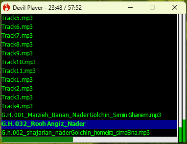
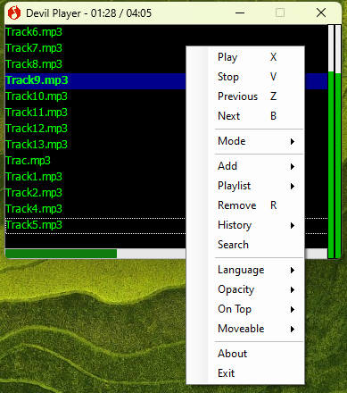

# 🎵 Devil Player

**Devil Player** is a lightweight and minimal audio player designed to play MP3 files quickly and efficiently. With its compact interface and straightforward controls, it’s perfect for users who want a no-frills, portable music player.

---

## ✨ Features

- 🎧 Play MP3 files with high audio quality  
- 📜 Playlist view with vertical scrolling  
- ⌨ Quick keyboard shortcuts:
  - `X` → Play
  - `V` → Stop
  - `Z` → Previous track
  - `B` → Next track
- ➕ Add single tracks or entire folders  
- 📂 Playlist management  
- 🔄 Playback history  
- 🌍 Multi-language support  
- 📌 **Always on Top** mode  
- 🖱 **Moveable Mode** — freely position the player anywhere  
- 📏 Ultra-compact UI, perfect for small or multi-monitor setups  

---

## 🖼 Screenshots

### Playlist View

### Long Track Names & Extended Playlists

---

## ⌨ Menu & Controls

| Option | Description |
|--------|-------------|
| **Play (X)** | Play the selected track |
| **Stop (V)** | Stop playback |
| **Previous (Z)** | Go to the previous track |
| **Next (B)** | Go to the next track |
| **Mode** | Change playback or display mode |
| **Add** | Add tracks to the playlist |
| **Playlist** | Manage playlists |
| **Remove (R)** | Remove selected track from playlist |
| **History** | View playback history |
| **Search** | Search tracks in the playlist |
| **Language** | Change interface language |
| **On Top** | Keep the player always on top |
| **Moveable** | Enable free window movement |
| **About** | Program information |
| **Exit** | Close the player |

---

## 📥 Installation & Usage

1. Download the program file.  
2. Run it directly (**no installation required — portable**).  
3. Add songs or folders using the **Add** menu or drag & drop them into the player.  

---

## ⚙ Requirements

- OS: **Windows XP / Vista / 7 / 8 / 10 / 11**  
- MP3 codec installed on your system

---

## 📜 License

This software is released under the **MIT License** — you are free to use, modify, and distribute it.
